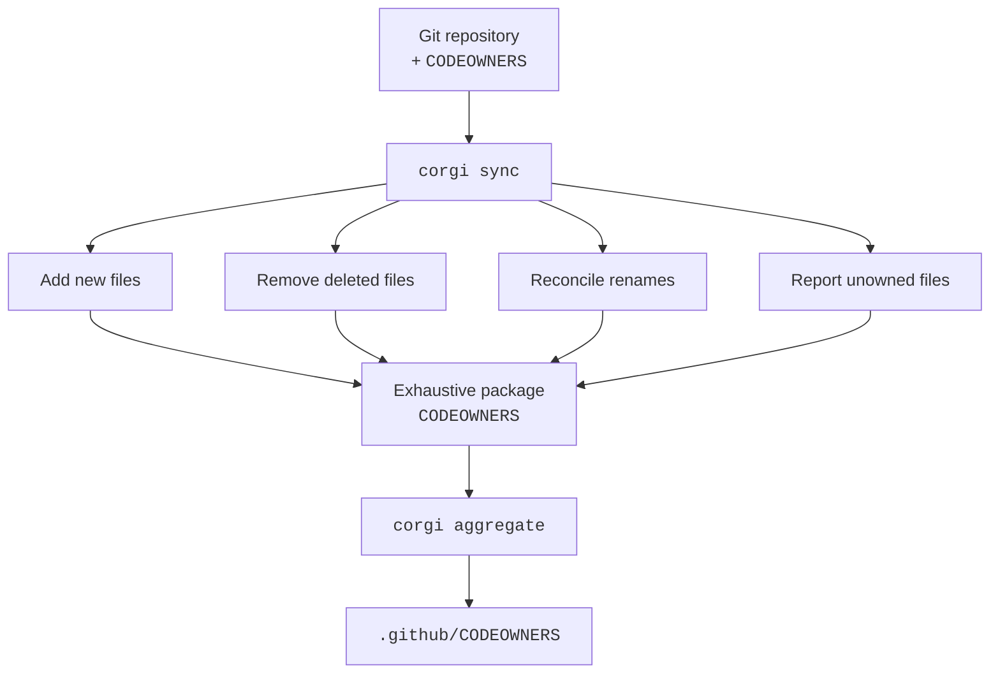

# CORGI

[](https://github.com/Mulugruntz/codeowners-corgi/releases/latest)
[](https://github.com/Mulugruntz/codeowners-corgi/actions/workflows/rust-tests.yaml)
[](https://github.com/Mulugruntz/codeowners-corgi/actions/workflows/rust-lint-and-format.yaml)
[](https://www.rust-lang.org/)


**Keep `CODEOWNERS` exhaustive, deterministic, and synchronized with the files Git actually sees.**

CORGI (**Co**de**O**wners **R**econciler for **G**it **I**ntegrity) is an opinionated Rust CLI for maintaining exhaustive `CODEOWNERS` manifests.

Instead of relying on broad wildcard rules as the final source of truth, CORGI reconciles ownership against the repository itself: adding new files, removing deleted ones, preserving ownership across renames where appropriate, respecting nested package boundaries and Git ignore rules, and reporting files that still need an owner.

It can also aggregate package-level manifests into the repository-wide `.github/CODEOWNERS` file GitHub reads.



### The model

* Every directory containing a `CODEOWNERS` file is a package root.
* Every managed, non-ignored file gets one explicit ownership entry.
* Nested package roots take ownership away from ancestor package roots.
* `# Rule[auto-assign]: ...` rules assign owners to new files without overwriting existing explicit ownership.
* `corgi sync` reconciles package manifests with Git-aware repository state.
* `corgi aggregate` builds the repository-wide generated section in `.github/CODEOWNERS`.
* `corgi migrate` converts conventional wildcard-based manifests into CORGI's exhaustive format.

## Commands

```bash
corgi sync
corgi aggregate
corgi migrate
```

## Model

- Every directory containing a `CODEOWNERS` file is a package root.
- Every managed non-ignored file in a package gets one explicit entry.
- Nested package roots take ownership away from ancestor package roots.
- `# Rule[auto-assign]: ...` comments are auto-assignment rules for new files only.
- `.github/CODEOWNERS` keeps its local `.github` ownership outside the generated section and stores the repository-wide aggregate inside the generated section.
- When `.github/CODEOWNERS` is the only manifest (no root `/CODEOWNERS`), its local section is promoted to cover the entire repository so every file remains owned by the file GitHub actually reads.

## Workflow

1. Run `corgi sync` to reconcile package manifests with Git-aware file state.
2. Run `corgi aggregate` to rebuild the generated aggregate in `.github/CODEOWNERS`.
3. Run `corgi migrate` once to convert conventional wildcard manifests into CORGI's exhaustive format.

`corgi sync` returns `1` when it updates a manifest or when at least one file remains unowned.
`corgi aggregate` returns `1` when it updates `.github/CODEOWNERS`.

## Auto-assignment rules

Rules use CODEOWNERS-style patterns and only apply inside the package where they are declared.
The most specific matching rule wins, and rules never overwrite an existing explicit file assignment.

```text
# Rule[auto-assign]: /src/** @org/backend
/src/lib.rs @org/backend
```

## File visibility

CORGI uses the `ignore` crate's WalkBuilder to discover files. This means:

- Repository-local `.gitignore` and `.git/info/exclude` are honored.
- **Machine-global Git ignores are not loaded.** CORGI explicitly disables global gitignore
  (`core.excludesFile` from the global Git config) so that output is repository-deterministic
  and does not depend on developer-specific machine configuration.
- **Tracked-then-ignored files are not managed.** If a file was committed and later added to
  `.gitignore`, the WalkBuilder follows `.gitignore` rules and does not consult Git's index.
  The file will be excluded from CORGI's output. This is a known limitation of the
  filesystem-walker approach.

## `.github/CODEOWNERS`

Use a local section plus generated section markers:

```text
# Local .github ownership/rules:
/.github/workflows/ci.yml @org/platform

# BEGIN CORGI GENERATED
/README.md @org/root
# END CORGI GENERATED
```

`corgi sync` only reconciles the local `.github` section.
`corgi aggregate` only rebuilds the generated section and ignores the previous generated contents as input.
When the aggregate would be empty, `corgi aggregate` omits the generated section entirely.

## Architecture

The repository is a two-crate Cargo workspace:

- `corgi-cli` is the root package and produces the `corgi` binary. It owns argument parsing, command dispatch, top-level error rendering, and process exit behavior.
- `corgi-core` lives in `crates/corgi-core` and owns Git repository discovery, CODEOWNERS parsing, reconciliation, migration, and aggregation. Its internal modules are private; the crate exposes only the operations used by the CLI plus its error type.

The CLI intentionally remains the root package instead of making the workspace root virtual. CORGI is distributed as a Rust pre-commit hook, and pre-commit installs Rust hook repositories with `cargo install --bins` from the repository root.

## pre-commit / prek

Either a `.pre-commit-config.yaml` file:

```yaml
- repo: https://github.com/Mulugruntz/codeowners-corgi
  rev: v0.1.0
  hooks:
    - id: corgi-sync
      language_version: system
    - id: corgi-aggregate
      language_version: system
```

Or a `prek.toml` file:

```toml
[[repos]]
repo = "https://github.com/Mulugruntz/codeowners-corgi"
rev = "v0.1.0"
hooks = [
    { id = "corgi-sync", language_version = "system" },
    { id = "corgi-aggregate", language_version = "system" },
]
```

Use only `corgi-sync` (and omit `corgi-aggregate`) when another aggregation tool manages the repository-wide `CODEOWNERS` output.

## Development

```bash
cargo fmt --all -- --check
cargo check --workspace --all-targets
cargo clippy --workspace --all-targets --all-features -- -D warnings
cargo test --workspace --all-features
```
